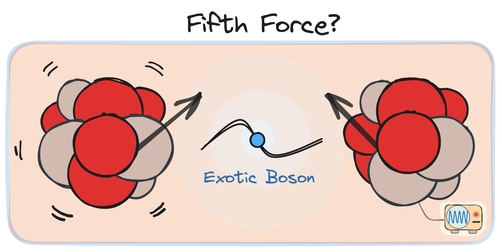
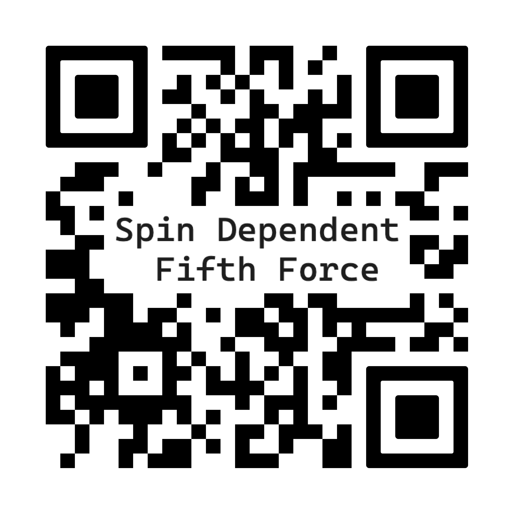

# Spin-Dependent Fifth-Force Limits

An open community platform for spin-dependent exotic interactions and fifth-force research.

## Quick Access

## 1. Overview

### What is SDFF?

Spin-dependent exotic interactions (SDFFs), also referred to as spin-dependent fifth forces, may arise from the exchange of a hypothetical boson of mass $M$ between fermions $X$ and $Y$, representing a possible extension beyond the [four fundamental forces](https://www2.lbl.gov/abc/wallchart/chapters/04/0.html).

Unlike conventional spin-independent interactions, SDFFs depend explicitly on the spin degrees of freedom of the involved particles, analogous in some aspects to magnetic interactions.

<figure style="text-align:center;">
  
  <figcaption>
    <b>Figure 1:</b> Illustration of an exotic boson mediating a spin-dependent fifth force between fermions.
  </figcaption>
</figure>

### What this platform provides

This repository provides a standardized and continuously updated research software platform for collecting, analyzing, and visualizing experimental constraints on spin-dependent exotic interactions.

The platform integrates curated datasets with interactive visualization and comparison tools, enabling researchers to:

- Access and compare constraints across different experiments and interaction types;
- Generate exclusion plots within a unified and consistent framework;
- Benchmark new theoretical models or experimental results against existing bounds;
- Contribute and update datasets as part of a growing community resource.

### Community Role

This project is designed as a **community-driven scientific software platform**, rather than a static dataset repository. It serves as a reference infrastructure for the field, accompanying recent review work and supporting ongoing theoretical and experimental studies.

For notation conventions and operator definitions, see the RMP review:
[Spin-Dependent Exotic Interactions](https://link.aps.org/doi/10.1103/RevModPhys.97.025005).

### Citation and Contribution

Please cite this repository as follows: . One can copy the BibTeX file from here: [**BibTeX Format**](./Citation.bib).

For contributions or to include your new results, please feel free to contact Dr. Lei Cong (congllzu@gmail.com), Dr. Wei Ji (weiji001@uni-mainz.de), or Prof. Dmitry Budker (budker@uni-mainz.de).

---

##  2. 🌐 Interactive Plot Viewer 
👉 **[Spin-Dependent Fifth-Force Interactive Viewer](https://lei-cong.github.io/Spin-Dependent-5th-Force-Limits/index_multi.html)**

The viewer allows users to:

- Select and overlay different coupling types (e.g., gAgA, gpgp, etc.);
- Display or hide datasets;
- Upload custom data files (λ [m], gg) for direct comparison.

<!--
Interactive viewer structure:

Dataset/normalized/  →  generate_manifest.py  →  datasets_multi.json  →  index_multi.html

- Dataset/normalized/: stores the actual data files.
- generate_manifest.py: scans the dataset folders and generates datasets_multi.json.
- datasets_multi.json: records dataset paths, groups, subfolders, and labels.
- index_multi.html: reads datasets_multi.json and displays the interactive plots.

After adding, deleting, renaming, or moving dataset files, regenerate the manifest:

    python generate_manifest.py

Then commit and push the updated datasets_multi.json file.
-->

<figure style="text-align:center;">
  
  <figcaption>
    <b>Figure 2:</b> Interactive Limits Viewer screenshot.
  </figcaption>
</figure>

---

## 3. Research Landscape 

### [Interaction Categories](Interaction-Categories.md)

### [Fermion Pairs](Fermion-Pairs.md)

### [Explore Experimental System](Experiments.md)

---

## 4.  Latest References 

## 5.Experimental Limits
📦 [Browse Full Documentation](Datasets.md)

## 6. Resources (Meetings, Scholarships, Openings)
📦 [Browse Full List](Resources.md)

---

## 7. Subscription 
[Click](https://docs.google.com/forms/d/1uBL-03QrSyvg8hI3q2GMD_WNH4RxMFbJobg6wHXMI7I/edit?usp=forms_home&ouid=108197834418205394547&ths=true) or scan (Your email address will be recorded, and you will receive notifications when major updates to the webpage occur):

<figure style="text-align:center;">
  
</figure>

---

## Acknowledgement

We would like to express our gratitude to Fadeev Pavel, Wei Ji for initiating the idea of this webpage. We sincerely acknowledge Haosen Guan for collecting most of the data. We deeply appreciate Yevgeny Stadnik for supervising the work on astrophysical limits and combined limits. We also extend our heartfelt thanks to Prof. Dmitry Budker for his invaluable support and guidance.

Additionally, we would like to thank all contributors, including Peng-Shun Luo, and [You], who provided data for this repository, enabling its comprehensive and collaborative nature.

## **Views count:**

 
 
