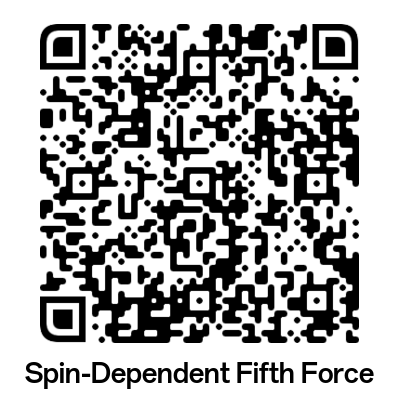

# Dataset Instruction

## Overview

This repository contains datasets of constraints on spin-dependent exotic interactions, also referred to as the spin-dependent fifth force (SDFF), mediated by the exchange of a single boson of mass M between fermions X and Y. The fifth force refers to a new force beyond the existing [four fundamental forces](https://www2.lbl.gov/abc/wallchart/chapters/04/0.html) of nature. A SDFF is a force that depends on the spins of the involved fermions, similar to the magnetic force. 

<figure style="text-align:center;">
  
  <figcaption><b>Figure 1:</b> An exotic boson carrying a fifth force that depends on the spins of the involved fermions.</figcaption>
</figure>

The interactions are categorized into the following types:

1. Axial-vector/vector, axial-vector/axial-vector, vector/vector.
2. Pseudoscalar/scalar, pseudoscalar/pseudoscalar, scalar/scalar.
3. Tensor/tensor, pseudotensor/tensor, and pseudotensor/pseudotensor.

As a reference, one may consult the format of the exotic potentials presented in the RMP review: [Spin-Dependent Exotic Interactions](https://doi.org/10.48550/arXiv.2408.15691).

The repository serves as a **live** webpage designed to present the latest experimental results. For contributions or to include your new results, please feel free to contact Dr. Lei Cong (congllzu@gmail.com), Dr. Wei Ji (weiji001@uni-mainz.de), or Prof. Dmitry Budker (budker@uni-mainz.de).

### Citation

Please cite this repository as follows: . One can copy the BibTeX file from here: [**BibTeX Format**](./Citation.bib).

---

## Datasets

<figure style="text-align:center;">
  
  <figcaption><b>Figure 2:</b> Studied and unexplored fermion pairs.</figcaption>
</figure>

### 1. $g_Ag_A$

- **Description**: Constraints for axial-vector/axial-vector couplings ($g_Ag_A$) are presented across different interaction categories, including lepton-lepton, lepton-nucleon, and nucleon-nucleon interactions.

- **Data**: The data are available in the folder [**gAgA**](./Dataset/normalized/gAgA/).

---

### 2. $g_Ag_V$
- **Description**: Constraints for vector/vector couplings ($g_Ag_V$).
- **Data**: The data are available in the folder [**gAgV**](./Dataset/normalized/gAgV/).

---

### 3. $g_Vg_V$
- **Description**: Constraints for vector/vector couplings ($g_Vg_V$).
- **Data**: The data are available in the folder [**gVgV**](./Dataset/normalized/gVgV/).

---

### 4. $g_pg_s$
- **Description**: Constraints for pseudoscalar/scalar couplings ($g_pg_s$).
- **Data**: The data are available in the folder [**gpgs**](./Dataset/normalized/gpgs/).
-  **Ciaran O'Hare's page**: The similar dataset for $g_pg_s$ can be found [here](https://github.com/cajohare/AxionLimits/tree/v1.0).

---

### 5. $g_pg_p$
- **Description**: Constraints for pseudoscalar/pseudoscalar couplings ($g_pg_p$).
- **Data**: The data are available in the folder [**gpgp**](./Dataset/normalized/gpgp/).

---

### 6. $g_sg_s$
- **Description**: Constraints for scalar/scalar couplings ($g_sg_s$).
- **Data**: The data are available in the folder [**gsgs**](./Dataset/normalized/gsgs/).

---

### 7. Tensor and Pseudotensor Interactions
- **Description**: Constraints for tensor and pseudotensor Interactions couplings.
- **Data**: *Please find the data in Tab. IV and V of our [review](https://doi.org/10.48550/arXiv.2408.15691)*

---

### 8. $V_1$ Results
- **Data**: The data are available in the folder [**V1**](./Dataset/normalized/V1/).

 
---
## Course
 - [TASI Lectures](https://www.colorado.edu/physics/events/summer-intensive-programs/theoretical-advanced-study-institute-elementary-particle-physics#TASI-2023)
 - ETH, [Quantum Technologies for Searches of New Physics](https://www.lehrbetrieb.ethz.ch/Vorlesungsverzeichnis/dozent.view?dozide=10032887&ansicht=2&semkez=2024W&lang=en)
- [University of Bologna](https://www.unibo.it/en/study/phd-professional-masters-specialisation-schools-and-other-programmes/course-unit-catalogue/course-unit/2024/492255)
- [Why Do We Think There's Physics Beyond the Standard Model? by Bryan Webber](https://www.youtube.com/watch?v=ZtKGH9qiWgQ&ab_channel=KavliInstituteforTheoreticalPhysics)
- [Probing New Physics at Precision Frontier - by Prof. Yotam Soreq ](https://www.google.com.hk/search?q=Prof.+Yotam+Soreq+%28Technion%29%3A+Probing+new+hadronic+forces+with+heavy+exotic+atoms+&sca_esv=021eb8b12bbb8799&hl=zh-CN&source=hp&ei=6TCcZ7qIE8Kxi-gP1YbvkAI&iflsig=ACkRmUkAAAAAZ5w--W6jyEqPjpWvvfEaxyphuZtvijwJ#fpstate=ive&vld=cid:a10a29a8,vid:jvxmCcIO1rA,st:0)

## Conference Information
- 17.01 to 20.01, 2025, [International Symposium on New Physics Beyond the Standard Model](https://isnp2025.casconf.cn/page/1830408968258850816), Sanya, China
- 17.02 to 21.02, 2025 [CAU BSM Workshop](https://indico.cern.ch/event/1492675/), Seoul, Korea
- 24.03 to 27.03, 2025[Criticality and Continuous Measurements in Quantum Sensing: From Theory to Experiments](https://indico.sns.it/event/81/)
- 04.05 to 14.05, 2025 [LULBI - Light \& ultralight BSM interactions](https://conferences.weizmann.ac.il/SRitp/May2025/sritp-advanced-school-lulbi-light-ultralight-bsm-interactions)
- 11.05 to 16.05, 2025, [Frontiers of Quantum Metrology for New Physics Searches](https://www.dpg-physik.de/veranstaltungen/2025/quantum_metrology_for_new_physics_searches), Bad Honnef, Germany
- 26.05 to 30.05, 2025 [10th International Conference on Precision Physics and Fundamental Physical Constants (FFK2025)](https://www.ffk2025.candela.org.pl/)
- 23.06 to 11.07, 2025 [Axions in Stockholm](https://indico.fysik.su.se/event/8808/)
- 04.08 to 15.08, 2025 [New ways to discover light new physics](https://indico.mitp.uni-mainz.de/event/410/), Mainz, Germany
 
## Job Information
- [Humboldt Research Fellowship](https://www.humboldt-foundation.de/en/apply/sponsorship-programmes/humboldt-research-fellowship)
- [Marie Skłodowska-Curie Actions - Postdoctoral Fellowships](https://marie-sklodowska-curie-actions.ec.europa.eu/actions/postdoctoral-fellowships); [More Information](https://mp.weixin.qq.com/s/Gx92VvQ4Hl2UAyHi9A3gFA)
- [Helmholtz-OCPC Postdoctoral Program](https://www.helmholtz.de/assets/helmholtz_gemeinschaft/user_upload/Ausschreibungen/2023/Call_Helmholtz-OCPC-Postdocprogram_2023.pdf); [OCPC Announcement](https://www.chinapostdoctor.org.cn/article?inid=cbcb0e46-8ed6-44ef-94c5-f2d78b8055c5&catname=%E9%80%9A%E7%9F%A5%E5%85%AC%E5%91%8A&catid=8c892b1c-4ade-4a5f-9a87-5e736cb5e9f9)
- [CSC-DAAD](https://www2.daad.de/deutschland/stipendium/datenbank/en/21148-scholarship-database/?detail=50015315)

---

## Subscription

[Click](https://docs.google.com/forms/d/1uBL-03QrSyvg8hI3q2GMD_WNH4RxMFbJobg6wHXMI7I/edit?usp=forms_home&ouid=108197834418205394547&ths=true) or scan:

<figure style="text-align:center;">
  
</figure>

---

## Acknowledgement

We would like to express our gratitude to Fadeev Pavel, Wei Ji for initiating the idea of this webpage. We sincerely acknowledge Haosen Guan for collecting most of the data. We deeply appreciate Yevgeny Stadnik for supervising the work on astrophysical limits and combined limits. We also extend our heartfelt thanks to Prof. Dmitry Budker for his invaluable support and guidance.

Additionally, we would like to thank all contributors, including [Name 1], [Name 2], and [Name 3], who provided data for this repository, enabling its comprehensive and collaborative nature.
